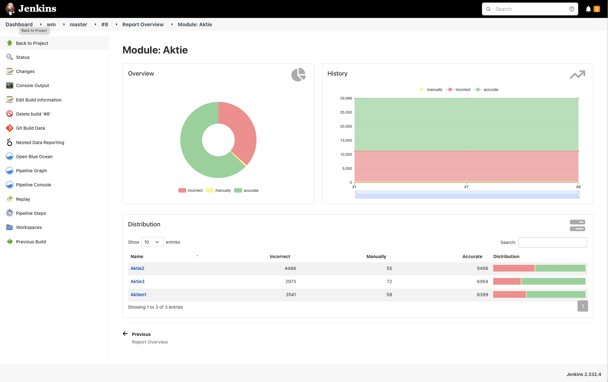

[](https://ci.jenkins.io/job/Plugins/job/nested-data-reporting-plugin/job/master/)


<br />
<p align="center">
  <a href="#">
   
  </a>

  <h1 align="center">Nested Data Reporting Plugin</h1>

  <p align="center">
    Jenkins plugin to report data from nested json as pie-charts, trend-charts and data tables.
    <br />
    <a href="https://github.com/jenkinsci/nested-data-reporting-plugin/blob/master/README.md"><strong>Explore the docs »</strong></a>
    <br />
    <br />
    <a href="https://github.com/jenkinsci/nested-data-reporting-plugin/issues/new/choose">Report Bug</a>
    ·
    <a href="https://github.com/jenkinsci/nested-data-reporting-plugin/issues/new/choose">Request Feature</a>
  </p>
</p>

## Introduction

This plugin reports data from a nested json file as pie-charts, trend-charts and data tables. 
If an item has `items`, the `result` will be computed automatically for this parent item.
An example json file looks like this: 

```
{
  "items": [
    {
      "id": "stocks",
      "name": "Stocks",
      "items": [
        {
          "id": "alphabet",
          "name": "Google",
          "result": {
            "incorrect": 1,
            "manually": 1,
            "accurate": 4
          }
        },
        {
          "id": "microsoft",
          "name": "Microsoft",
          "result": {
            "incorrect": 2,
            "manually": 1,
            "accurate": 5
          }
        }
      ]
    },
    {
      "id": "derivates",
      "name": "Derivates",
      "result": {
        "incorrect": 2,
        "manually": 3,
        "accurate": 10
      }
    },
    {
      "id": "fonds",
      "name": "Fonds",
      "result": {
        "incorrect": 6,
        "manually": 7,
        "accurate": 20
      }
    },
    {
      "id": "warrants",
      "name": "Warrants",
      "result": {
        "incorrect": 6,
        "manually": 4,
        "accurate": 15
      }
    }
  ],
  "colors": {
    "incorrect": "#EF9A9A",
    "manually": "#FFF59D",
    "accurate": "#A5D6A7"
  }
}
```

To check your json you can use the [json schema](src/main/resources/report.json) to validate it.

> ⚠️ **Color Mapping**:
>
> The attribute "colors" needs exactly the same attributes as the result of the 
> items and assigns a color to each attribute, which is used for the graphical representation. Otherwise
> a default color `#E9E9E9` is used for the missing property!


### Visualization

At job level, a trend chart is generated showing the development 
of the items included in the json over all builds.

Since version **2.4.0**, the view is dynamically built and always contains a pie chart, a history and a table.

The pie chart and the hsitory show the aggregated results of the underlying items.

The table then shows the individual underlying items and visualizes the distribution of the properties in the table.

By clicking on a corresponding row, the view is filtered according to the selection. 
However, the structure remains the same. This can be continued until no more subitems are 
available in the json model. On the lowest level only the pie chart and the history will be displayed.

The limited visualization from version **2.3.0** is thus resolved.

> ~~⭕  **Limited visualization**:~~
>
> ~~In version **2.3.0** currently only the first two levels are visualized. 
> The values of all items below are not displayed visually, but are 
> of course represented in the aggregation of the first two levels.~~


### Example



## Getting started

### Pipeline Step

```
publishReport reportFile: "etc/result.json"
```

### Parameter: 

##### reportFile: 
The path to the report file. At the moment yaml/yml or json files are supported.

##### displayType (optional, default = `absolute`):
This can be used to determine the representation of the values within the table.
Choose between `absolute`, `relative` or `dual`. 

## Issues

Report issues and enhancements in the [GitHub Issue Tracker](https://github.com/jenkinsci/nested-data-reporting-plugin/issues)

## Contributing

Contributions are what make the open source community such an amazing place to be learn,
inspire, and create. Any contributions you make are **greatly appreciated**.

1.  Fork the Project
2.  Create your Feature Branch (`git checkout -b feature/AmazingFeature`)
3.  Commit your Changes (`git commit -m 'Add some AmazingFeature'`)
4.  Push to the Branch (`git push origin feature/AmazingFeature`)
5.  Open a Pull Request

## LICENSE

Licensed under MIT, see [LICENSE](LICENSE)

