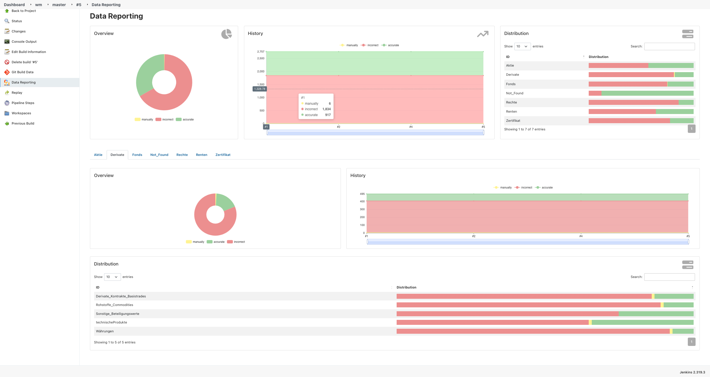

<br />
<p align="center">
  <a href="#">
   
  </a>

  <h1 align="center">Data Reporting Plugin</h1>

  <p align="center">
    Jenkins plugin to report data from nested json as pie-charts, trend-charts and data tables.
    <br />
    <a href="https://github.com/simonsymhoven/data-reporting-plugin/blob/master/README.md"><strong>Explore the docs »</strong></a>
    <br />
    <br />
    <a href="https://github.com/simonsymhoven/data-reporting-plugin/issues">Report Bug</a>
    ·
    <a href="https://github.com/simonsymhoven/data-reporting-plugin/issues">Request Feature</a>
  </p>
</p>

## Introduction

This plugin reports data from a nested json file as pie-charts, trend-charts and data tables. 
If a component has `items` the `result` will be computed automatically for the parent item.
An example json file looks like this: 

```
{
  "components": [
    {
      "id": "Aktien",
      "items": [
        {
          "id": "Aktie 1",
          "result": {
            "incorrect": 1,
            "manually": 1,
            "accurate": 4
          }
        },
        {
          "id": "Aktie 2",
          "result": {
            "incorrect": 2,
            "manually": 1,
            "accurate": 5
          }
        }
      ]
    },
    {
      "id": "Derivate",
      "result": {
        "incorrect": 2,
        "manually": 3,
        "accurate": 10
      }
    },
    {
      "id": "Fonds",
      "result": {
        "incorrect": 6,
        "manually": 7,
        "accurate": 20
      }
    },
    {
      "id": "Optionsscheine",
      "result": {
        "incorrect": 6,
        "manually": 4,
        "accurate": 15
      }
    }
  ],
  "colors": {
    "incorrect": "#EF9A9A",
    "manually": "#FFF59D",
    "accurate": "#A5D6A7"
  }
}
```

At job level, a trend chart is generated showing the development 
of the items included in the json over all builds.

At the build level, the aggregation of the entire JSON file 
is first displayed as a pie chart and as a filterable history. 
Next to it, the first level of the underlying items is listed in a table, 
together with the result of the respective aggregation of the child items.

Below is a tab panel that contains all the elements of the first level. 
Here again, the aggregation of the child elements is displayed as a pie chart 
and as a filterable trend history, as well as a table with the individual child elements and 
their distribution of the aggregated results of their child elements.

> ⭕  **Limited visualization**:
>
> In version **2.3.0** currently only the first two levels are visualized. 
> The values of all items below are not displayed visually, but are 
> of course represented in the aggregation of the first two levels.

### Example



## Getting started

### Pipeline Step

```
publishReport jsonFile: "etc/result.json", label: 'My awesome label' 
```

#### Parameter: 

The currently supported parameters are:

- **`jsonFile`**path to json file relative to the workspace.

or 

- **`jsonString`**: the json model as string.

and **optional**
- **`label`**: the label for the build action (default: "Data Reporting").

## Issues

Report issues and enhancements in the [GitHub Issue Tracker](https://github.com/simonsymhoven/data-reporting-plugin/issues)

## Contributing

Contributions are what make the open source community such an amazing place to be learn,
inspire, and create. Any contributions you make are **greatly appreciated**.

1.  Fork the Project
2.  Create your Feature Branch (`git checkout -b feature/AmazingFeature`)
3.  Commit your Changes (`git commit -m 'Add some AmazingFeature'`)
4.  Push to the Branch (`git push origin feature/AmazingFeature`)
5.  Open a Pull Request

## LICENSE

Licensed under MIT, see [LICENSE](LICENSE)

